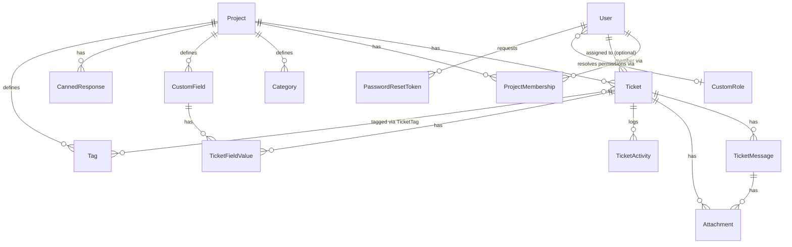

# مساعدة الدعم الفني — نظام تذاكر متعدد المشاريع (Multi-Project Helpdesk)

A production-grade, Arabic-first (RTL) ticketing/helpdesk web app. It serves
two audiences: contractors/end users who open and track support tickets
with no account needed, and a support team that works those tickets from an
authenticated dashboard. The platform is multi-project — one deployment
serves any number of branded client projects (e.g. **رقابة+**), each with
its own URL, ticket-form configuration, categories, SLA timings, and
project-scoped team.

## Table of contents

- [Tech stack](#tech-stack)
- [Running locally](#running-locally)
- [Two kinds of users](#two-kinds-of-users)
- [Multi-project architecture](#multi-project-architecture)
- [Database schema](#database-schema)
- [Access control and roles](#access-control-and-roles)
- [Ticket-form configuration](#ticket-form-configuration)
- [Core features](#core-features)
- [Security](#security)
- [Production-readiness integrations](#production-readiness-integrations)
- [Mobile UX](#mobile-ux)
- [Testing](#testing)
- [Path to production deploy](#path-to-production-deploy)
- [Project structure](#project-structure)
- [Scaling](#scaling-one-shared-database-not-one-per-project)
- [Known limitations](#known-limitations)

## Tech stack

- **Next.js 14** (App Router) + **TypeScript**
- **Tailwind CSS** — Arabic-safe font stack, light/dark via `prefers-color-scheme`
- **Prisma ORM** — ships with **SQLite** for zero-dependency local dev
  (`prisma/dev.db`); switching to Postgres in production is a one-line
  datasource change (see [Path to production deploy](#path-to-production-deploy))
- **Auth.js (NextAuth v5)**, Credentials provider (email + bcrypt password,
  optionally a second TOTP step), for the support team only (`SUPER_ADMIN` /
  `ADMIN` / `AGENT` / `CUSTOM` roles)
- **otplib** + **qrcode** — self-service TOTP 2FA, no external service
- **recharts** for the reporting dashboard
- **nodemailer** for email notifications (ticket lifecycle + password
  reset) — degrades gracefully (logs to console instead of crashing) when
  SMTP env vars aren't set
- **`@aws-sdk/client-s3`** — optional S3-compatible attachment storage
  driver, unused unless `STORAGE_DRIVER=s3`
- **`ioredis`** — optional shared rate-limit backend, unused unless
  `REDIS_URL` is set
- **`@sentry/nextjs`** — optional error tracking, inert unless
  `SENTRY_DSN`/`NEXT_PUBLIC_SENTRY_DSN` is set
- **Vitest** — automated unit/integration test suite (see [Testing](#testing))

## Running locally

```bash
npm install
npx prisma migrate dev     # applies the schema to prisma/dev.db
npm run prisma:seed        # seeds users + three demo projects with tickets
npm run dev                # http://localhost:3000
```

If you're picking up an existing `dev.db` that predates this schema, reset
rather than trying to backfill it:

```bash
npx prisma migrate reset --force --skip-seed   # drops + recreates dev.db, replays migrations
npm run prisma:seed
```

### Seeded data

| Role | Email | Password | Project membership |
|---|---|---|---|
| `SUPER_ADMIN` | `admin@raqaba.local` | `ChangeMe123!` | n/a — global |
| `AGENT` | `agent@raqaba.local` | `Agent123!` | `raqaba` **and** `demo` |
| `ADMIN` | `testadmin@raqaba.local` | `TestAdmin123!` | `demo` **only** — use this account to verify scoping (it must NOT see `raqaba`/`acme`) |
| `CUSTOM` ("وكيل أول" / Senior Agent) | `senioragent@raqaba.local` | `SeniorAgent123!` | `demo` **only** — base `AGENT` + `canViewReports` + `canManageCannedResponses` only. Use this account to verify the custom-role permission gates: it CAN reach `/dashboard/reports` and manage canned responses for `demo`, but cannot reach `/dashboard/roles`, `/dashboard/agents`, or `demo`'s ticket-form config |

Three projects are seeded:

- **`/raqaba`** — "رقابة+", ticket prefix `RQ`, teal/amber accent, the real
  FAQ URL, with sample tickets attached.
- **`/demo`** — "مشروع تجريبي", ticket prefix `DEMO`, a distinct blue
  accent, no FAQ URL, with sample tickets.
- **`/acme`** — "مشروع اختبار ثالث", ticket prefix `ACME`, purple accent —
  a third project with no members other than `SUPER_ADMIN`, useful for
  confirming a project with zero team members still works publicly and is
  invisible to non-members in the dashboard.

Two demonstration `CustomField` rows are also seeded, one per project:
`raqaba` gets a **required `SELECT`** field ("نوع الأصل" / asset type,
options: مركبة/معدات/مبنى/أخرى) and `demo` gets an **optional `TEXT`**
field ("ملاحظة مرجعية" / reference note).

**Change the admin password immediately** — it's printed in the seed script
output specifically as a reminder. A self-service "forgot password" flow
exists (see [Security](#security)) so this no longer requires Prisma Studio
or a manual script.

### Environment variables

Copy `.env.example` to `.env` (a working `.env` is already included for
local dev) and fill in real values for production:

| Var | Required? | Notes |
|---|---|---|
| `DATABASE_URL` | yes | `file:./dev.db` for SQLite, or a Postgres connection string in prod |
| `NEXTAUTH_SECRET` | yes | Generate with `openssl rand -base64 32` |
| `NEXTAUTH_URL` / `APP_BASE_URL` | yes | Public base URL of the app (used in email links, incl. password-reset links) |
| `SMTP_HOST`, `SMTP_PORT`, `SMTP_USER`, `SMTP_PASS`, `SMTP_FROM` | no | If any of `SMTP_HOST`/`SMTP_USER`/`SMTP_PASS` are missing, email sending **no-ops and logs to the console** (including the password-reset link) instead of crashing. |
| `HCAPTCHA_SITE_KEY`, `HCAPTCHA_SECRET_KEY` | no | Enables hCaptcha on the public ticket form. Both must be set. |
| `RECAPTCHA_SITE_KEY`, `RECAPTCHA_SECRET_KEY` | no | Enables reCAPTCHA v2 instead, if hCaptcha vars aren't set. |
| `STORAGE_DRIVER` | no | `local` (default) or `s3`. See [Production-readiness integrations](#production-readiness-integrations). |
| `S3_BUCKET`, `S3_REGION`, `S3_ACCESS_KEY_ID`, `S3_SECRET_ACCESS_KEY` | only if `STORAGE_DRIVER=s3` | Required together when the S3 driver is selected. |
| `S3_ENDPOINT`, `S3_FORCE_PATH_STYLE` | no | Optional even with `STORAGE_DRIVER=s3` — set `S3_ENDPOINT` for R2/MinIO (omit for real AWS S3), `S3_FORCE_PATH_STYLE=true` if your provider needs path-style addressing. |
| `REDIS_URL` | no | Set to switch `src/lib/rateLimit.ts` to the Redis-backed limiter. |
| `SENTRY_DSN`, `NEXT_PUBLIC_SENTRY_DSN` | no | Server/edge and client DSNs respectively (usually the same value). |
| `SENTRY_ORG`, `SENTRY_PROJECT`, `SENTRY_AUTH_TOKEN` | no | Only needed for source-map upload at build time; without them the build just skips that step. |

## Two kinds of users

1. **Contractors / end users (submitters)** — no account needed. They open a
   ticket via a project's public form (`/{slug}/tickets/new`, respecting
   that project's field config) and can look up ticket status later with
   **ticket number + phone number** (no password), scoped to that project.
2. **Support team** — full login via NextAuth, project-scoped per the
   access-control model below. `AGENT` works tickets in their project(s).
   `ADMIN` additionally manages that project's team, ticket-form config,
   canned responses, and reports. `SUPER_ADMIN` additionally manages all
   projects and project membership globally.

## Multi-project architecture

- **Isolation model**: one shared Next.js app, one shared database. A
  `Project` row (id, slug, name, accentColorHex, faqUrl, ticketPrefix,
  ticketSeq, plus ticket-form field-mode columns) represents each client.
  Every `Ticket` belongs to exactly one `Project` (`Ticket.projectId`), and
  all public-facing pages are scoped by project via the URL.
- **Per-project customization**: branding (name, accent color, FAQ URL,
  ticket prefix), the ticket-form field configuration, ticket categories,
  and SLA-by-priority timings. Nothing about a project's configuration is
  global/shared.
- **Ticket numbering is per-project**: each `Project` has its own `ticketSeq`
  counter, incremented transactionally (`{ increment: 1 }` in the same
  `project.update()` call that reads the new value back), so numbers like
  `RQ-000123` / `DEMO-000045` never collide or race across projects.

### URL scheme

| URL | What it is |
|---|---|
| `/` | Project directory / picker — lists all active projects, links into each |
| `/{slug}` | Project landing page (branded) |
| `/{slug}/tickets/new` | Open a new ticket, scoped to that project, respecting its ticket-form config |
| `/{slug}/tickets/track` | Track/reply to a ticket, scoped to that project |
| `/tickets/new`, `/tickets/track` | Legacy redirects → `/raqaba/tickets/...` |
| `/forgot-password`, `/reset-password` | Agent/admin self-service password reset |
| `/dashboard` | Ticket queue — scoped to the viewer's project membership; row checkboxes/bulk actions, CSV export, a "my tickets" quick filter |
| `/dashboard/export.csv` | CSV export of the **currently filtered** ticket queue — same scoping/filters as `/dashboard` |
| `/dashboard/tickets/[id]` | Ticket detail — reply, controls, tags, canned responses, activity log, CSAT rating |
| `/dashboard/reports` | `ADMIN`/`SUPER_ADMIN` — scoped reports, incl. average CSAT |
| `/dashboard/agents` | `ADMIN`/`SUPER_ADMIN` — scoped team management |
| `/dashboard/canned-responses` | `ADMIN`/`SUPER_ADMIN` — manage reusable reply templates |
| `/dashboard/projects` | `SUPER_ADMIN`: create/edit any project. `ADMIN`: read-only list of their own project(s) |
| `/dashboard/projects/[id]` | Project detail: ticket-form config (SUPER_ADMIN + project ADMIN) + team members (SUPER_ADMIN only) |
| `/dashboard/change-password` | Forced first-login password change for admin-created accounts |
| `/dashboard/settings` | Any logged-in staff account — self-service TOTP 2FA enrollment/disable |
| `/dashboard/audit` | `SUPER_ADMIN`-only — the admin activity log |
| `/dashboard/roles` | `SUPER_ADMIN`-only — manage custom roles |
| `/csat/[ticketId]` | Public, unauthenticated one-click CSAT rating landing page — linked from the "resolved" notification email |
| `/api/health` | Load-balancer/uptime probe — checks DB connectivity, not just process liveness |

A slug that doesn't match any `Project` row 404s (via `getProjectBySlugOr404`
in `src/lib/projects.ts`).

## Database schema

Single shared database (SQLite in dev at `prisma/dev.db`, Postgres in
production — see [Path to production deploy](#path-to-production-deploy)),
one schema, everything client-specific scoped by `projectId` rather than one
database per client (see [Scaling](#scaling-one-shared-database-not-one-per-project)).
The full schema, with its design-decision comments, lives in
[`prisma/schema.prisma`](prisma/schema.prisma) — this section is a map to
read before diving into that file, not a replacement for it.

### Entities at a glance

| Model | Purpose |
|---|---|
| `Project` | One client/tenant (e.g. "رقابة+"). Owns branding, ticket-form field config, per-project SLA targets, and its own `ticketPrefix`/`ticketSeq` counter. |
| `User` | A support-team account (`SUPER_ADMIN`/`ADMIN`/`AGENT`/`CUSTOM`). Submitters are **not** `User` rows — see below. |
| `CustomRole` | SUPER_ADMIN-defined variant of `ADMIN`/`AGENT` with 4 independently togglable extra permissions. Only meaningful when `User.role === "CUSTOM"`. |
| `ProjectMembership` | Join table granting an `ADMIN`/`AGENT`/`CUSTOM` user visibility into one `Project`. `SUPER_ADMIN` bypasses it (global, unscoped). |
| `Ticket` | The core record. Belongs to one `Project`; optionally assigned to one `User`. Submitter identity (`submitterName`/`Phone`/`Email`) is stored directly on the ticket, not a separate account. |
| `TicketMessage` | One message in a ticket's thread — either from the submitter or a staff reply/internal note (`isInternalNote`). |
| `Attachment` | A file on a ticket, optionally tied to one `TicketMessage`. Storage location handled by `src/lib/storage.ts` (local disk by default, or S3-compatible). |
| `TicketActivity` | Auto-logged status/priority/category/assignment/tag changes for one ticket — a plain-string audit trail, not FK'd to the old/new value. |
| `AdminActivity` | Same idea, for admin-level actions (project/role/membership/agent-account changes) that aren't tied to a single ticket. No FK to its target — a human-readable snapshot instead, since the target row may since have been deleted. |
| `Category` | A project-defined ticket category (`key` + Arabic `label`, ordered). |
| `CustomField` / `TicketFieldValue` | Project-defined extra ticket-form fields, and each ticket's stored value for one. `options` (for `SELECT` fields) is a JSON string — SQLite has no native array/JSON column type. |
| `Tag` / `TicketTag` | Project-scoped labels, many-to-many with `Ticket`. |
| `CannedResponse` | A reusable reply template scoped to one project. |
| `PasswordResetToken` | Hashed (never raw), single-use, 1-hour-expiry token for the staff "forgot password" flow. |

### Relationships



`AdminActivity` isn't in the diagram — it deliberately has no foreign keys
(see the model's comment in `prisma/schema.prisma`).

### Modeling decisions worth knowing before you touch this

- **String-enums, not Prisma enums, in the active schema.** SQLite has no
  native enum type, so `role`, `priority`, `status`, `authorType`, and a
  handful of others are plain `String` columns with the allowed values
  enforced in application code (see the header comment block in
  `prisma/schema.prisma`) rather than at the database level.
  `prisma/schema.postgres.prisma` is a ready-to-apply reference schema with
  real Prisma `enum`s for all of these **except** `Ticket.category`, which
  stays a plain string on purpose even in Postgres — it holds a
  project-defined `Category.key` rather than a fixed set of values, so it
  must never become an enum (see that file's own header for the full
  reasoning). Don't hand-edit `schema.postgres.prisma` without also updating
  `schema.prisma`, or the two will drift.
- **Everything client-specific hangs off `projectId`.** Tickets, categories,
  custom fields, tags, canned responses, and team membership all carry a
  `projectId` foreign key with `onDelete: Cascade` — deleting a `Project`
  cleans up everything under it. There is deliberately **one shared
  database**, not one per client — see
  [Scaling](#scaling-one-shared-database-not-one-per-project) for why.
- **Submitters aren't `User` rows.** A ticket's submitter identity lives
  directly on `Ticket` (`submitterName`/`submitterPhone`/`submitterEmail`).
  Public tracking (`/{slug}/tickets/track`) authenticates with **ticket
  number + phone number**, not a password — there's no submitter account to
  look up.
- **Composite indexes match real query shapes, not just single columns** —
  `[projectId, createdAt]`, `[projectId, status]`, `[projectId, slaDueAt]` on
  `Ticket`, since every dashboard query filters by project first, then
  filters/sorts by one of these.
- **Two audit trails, both plain-string snapshots, not FK'd to the changed
  value.** `TicketActivity` (per-ticket) and `AdminActivity` (admin-level)
  both store `fromValue`/`toValue` as strings rather than relations —
  intentional, so the log stays readable even after the referenced role,
  member, or project is gone. A renamed user or project shows its *old*
  name in historical log entries — an audit log should read as "what
  happened at the time," not silently rewrite itself later.

### Migrations & seeding

`npx prisma migrate dev` applies the schema, `npm run prisma:seed` loads 3
demo projects/users/tickets (see [Running locally](#running-locally)).
Migration history (`prisma/migrations/`) is committed and should ship as-is;
don't regenerate it from scratch against a production database. For the
SQLite → Postgres move needed before a real production deploy, see
[Path to production deploy](#path-to-production-deploy).

## Access control and roles

A `ProjectMembership` join table (`userId`, `projectId`, unique on the pair)
gates what `ADMIN`/`AGENT`/`CUSTOM` accounts can see:

- **`SUPER_ADMIN`** stays fully global — sees/manages every project, every
  ticket, every user, completely unaffected by `ProjectMembership`.
- **`ADMIN`**, **`AGENT`**, and **`CUSTOM`** accounts **require at least one
  `ProjectMembership` row** to see anything. Every dashboard view (ticket
  queue, ticket detail, reports, agents list, canned responses, tags) is
  scoped to only the project(s) they're a member of. An account with zero
  memberships gets a 404 on dashboard pages (see `requireScopedViewer` in
  `src/lib/access.ts`) — a provisioning issue, not a broken link, but
  rendered as the same "not found" the app already uses elsewhere for
  consistency.
- Direct-URL access to a ticket or project **outside** the viewer's
  membership 404s too — every dashboard route and server action checks
  `canAccessProject()` before touching data, so scoping can't be bypassed
  by hitting a server action directly.
- **`ADMIN` is effectively a "project admin"**: within their assigned
  project(s) they can manage that project's team, ticket-form
  configuration, and see that project's reports and canned responses.
- **`SUPER_ADMIN` manages project membership** from the project edit page
  (`/dashboard/projects/[id]`) — adds/removes members. An `ADMIN` viewing
  their own project sees a read-only member list and is pointed to
  `/dashboard/agents` to invite new accounts instead.

`src/lib/access.ts` centralizes this: `getViewerScope()` resolves the
current session into `{ isSuperAdmin, projectIds, permissions }`, and
`requireScopedViewer()` / `requireProjectAccess()` / `scopedProjectWhere()`
are used throughout the dashboard route handlers and server actions so the
same scoping rule can't be bypassed.

### Roles

| Role | Can do |
|---|---|
| `SUPER_ADMIN` | Everything, globally, unaffected by `ProjectMembership`: all projects, all tickets, all users, project membership management |
| `ADMIN` | Everything `AGENT` can, within their project(s), **plus**: manage that project's team, ticket-form config, reports, canned responses |
| `AGENT` | Work tickets (reply, reassign, change status/priority/category, tag) within their project(s) only |
| `CUSTOM` | A named variant of `ADMIN` or `AGENT` with a hand-picked subset of the extra permissions above — see below |

### Custom roles

`SUPER_ADMIN`-only. A `CustomRole` is a **named variant of `ADMIN` or
`AGENT`** (`baseRole`) with 4 independently toggleable extra permissions
layered on top — intentionally not a full ground-up permissions matrix:

| Toggle | Gates |
|---|---|
| `canManageTeam` | `/dashboard/agents` — invite/remove project team members, assign non-`SUPER_ADMIN` roles (including other custom roles) |
| `canManageTicketForm` | The ticket-form config section on `/dashboard/projects/[id]` — built-in field modes **and** custom-field/category definitions |
| `canViewReports` | `/dashboard/reports` |
| `canManageCannedResponses` | Create/edit canned responses (using an existing one in a reply stays available to **every** project member regardless of role) |

A `User` whose `role` column is `"CUSTOM"` is linked to exactly one
`CustomRole` via `customRoleId`; effective permissions resolve through that
row instead of the built-in role table. Baseline ticket-working behavior —
viewing the queue/ticket detail within assigned projects, replying,
changing status/priority/category, assigning tickets, tagging, and editing
custom-field values — is **not** gated by any of the 4 toggles and is
identical for every project member.

Built-in `ADMIN` behaves as if all 4 toggles are permanently `true`, built-in
`AGENT` as if all 4 are permanently `false` — computed in
`permissionsForBaseRole()` (`src/lib/access.ts`), never stored, so it can't
drift out of sync with a real `CustomRole` row. Custom roles are always
project-scoped exactly like `ADMIN`/`AGENT` — only `SUPER_ADMIN` itself is
ever unscoped. **Deleting a role in use is blocked** (not reassigned) —
`deleteCustomRoleAction` returns an error naming the affected account count,
since silently reassigning would change someone's effective permissions as
a side effect of an unrelated cleanup click.

Managed from `/dashboard/roles`. The role picker on `/dashboard/agents`
lists custom roles alongside the 3 built-ins, under an "أدوار مخصصة"
`<optgroup>`.

## Ticket-form configuration

Not a full dynamic form builder — a fixed, small set of togglable built-in
fields, plus project-defined categories, custom fields, and SLA timings.
Everything here is managed from `/dashboard/projects/[id]`, gated by
`canManageTicketForm`, and every value is **re-validated server-side on
submit** regardless of what the client sent — a spoofed/removed
`required`/`HIDDEN` field via devtools is always rejected or ignored by the
server, never trusted.

### Built-in field modes

Modeled as plain string columns on `Project` (`emailMode`,
`contractNumberMode`, `attachmentsMode`, `categoryMode`, `priorityMode`) —
the field set is fixed and small, so a separate table wasn't worth it:

- **البريد الإلكتروني (email), رقم العقد (contract number), المرفقات
  (attachments)**: `REQUIRED` / `OPTIONAL` / `HIDDEN`.
- **التصنيف (category), الأولوية (priority)**: `REQUIRED` / `OPTIONAL`
  **only** — no `HIDDEN`, since they drive routing/SLA. Left blank when
  `OPTIONAL`, the server defaults category → the project's first category
  by `order`, priority → `MEDIUM` — applied server-side in
  `createTicketAction`, never assumed client-side.
- **الاسم، الجوال، العنوان، الوصف (name, phone, subject, description)**
  remain always required and aren't configurable — they're load-bearing for
  identifying the submitter and knowing what's wrong.
- Every project defaults to `email = OPTIONAL, contractNumber = OPTIONAL,
  category = REQUIRED, priority = REQUIRED, attachments = OPTIONAL`.

### Categories

A real `Category` model (`id`, `projectId`, `key`, `label`, `order`),
replacing what used to be a single hardcoded global list — `Ticket.category`
still stores a plain string key, but the set of valid keys is per-project.
New projects are seeded with the same default 6-category set
(`DEFAULT_CATEGORIES` in `src/lib/categories.ts`), fully editable afterward.
`key` is derived from `label` and immutable after creation (only `label` and
`order` can change — the key is what historical tickets reference). Deleting
a category still referenced by a ticket, or a project's last remaining
category, is blocked with an explanatory error.

The reports page's "by category" breakdown only renders when a single
project is selected — with categories no longer global, there's no single
meaningful axis to chart multiple projects' categories on at once (a
different project's `"OTHER"`-equivalent key isn't guaranteed to mean the
same thing). The ticket-queue category **filter** stays available across
projects, grouped by project in an `<optgroup>`, since picking one option
from a grouped list is a much smaller ask than reading an ambiguous chart.

### Custom fields

`CustomField` (id, projectId, `key`, `label`, `fieldType`: `TEXT` /
`TEXTAREA` / `NUMBER` / `DATE` / `SELECT` / `CHECKBOX`, `required`,
`options` — JSON array, `SELECT` only, `order`) and `TicketFieldValue`
(ticketId, customFieldId, `value` — always stored as a string, cast/
formatted per `fieldType` only at the UI layer). Rendered on the public
form after the built-in fields, in `order`. `fieldType` and `key` are
immutable after creation — both control how already-submitted values must
be interpreted; delete and re-create instead of changing them. On the
ticket detail page, values are editable by any project member (a baseline
ticket-editing action, not gated by `canManageTicketForm` — that gates the
field *definitions*, not per-ticket *values*). A required, unchecked
`CHECKBOX` is never blocking — HTML checkboxes have no meaningful "empty"
state distinct from unchecked.

### SLA timings

Four plain columns on `Project` — `slaUrgentHours`, `slaHighDays`,
`slaMediumDays`, `slaLowDays` (defaults `4`/`1`/`3`/`5`, urgent is
wall-clock hours, the rest are business days skipping Friday/Saturday — see
`computeSlaDueAt()` in `src/lib/sla.ts`). Editable per project from
`/dashboard/projects/[id]`, with server-side validation that values are
positive integers.

## Core features

- **Canned responses** (`CannedResponse`: projectId, title, body,
  createdBy) — managed from `/dashboard/canned-responses`. Any project
  member sees a picker in the reply box that inserts the body into the
  reply textarea, still fully editable before sending, never auto-sent.
- **Tags** (`Tag`, project-scoped, unique name per project; `TicketTag`
  many-to-many join) — add an existing tag, type a new one inline (with an
  optional hex color), or remove one from a ticket's detail page. The
  ticket queue has a matching filter.
- **Activity log** (`TicketActivity`) — auto-logged whenever status,
  priority, category, or assignment changes (including the automatic
  "reply nudges status to PENDING" transition), or a tag is added/removed.
  Shown as a separate "سجل النشاط" timeline in the ticket detail sidebar,
  deliberately **not** interleaved into the message thread — the thread is
  submitter-facing conversation history, the log is internal bookkeeping.
- **CSAT (customer satisfaction) rating** — `Ticket.satisfactionRating`
  (1–5) and `satisfactionSubmittedAt`. Marking a ticket `RESOLVED` sends a
  notification with 5 one-click star links (`/csat/[ticketId]?rating=N`,
  a public unauthenticated route). Already-rated tickets show "already
  rated" and never get overwritten — idempotent by design, since it's a
  plain GET link (see [Known limitations](#known-limitations) for the
  trade-off). Shown on the ticket detail page and averaged, per project
  scope, on `/dashboard/reports`.
- **Bulk actions on the ticket queue** — row checkboxes, bulk status
  change, bulk assign (including a one-click "assign to me"), bulk add-tag.
  Server actions independently re-check `canAccessProject()` for every
  ticket id received — a submitted id list is never trusted just because
  the UI only rendered checkboxes for visible tickets. Ids that fail the
  check are silently skipped and counted, not applied. Each successful
  change logs the same `TicketActivity` shape the single-ticket flow does.
- **CSV export** (`/dashboard/export.csv`) — exports the **currently
  filtered** queue, not just the current page. The `where`/`orderBy`
  builder (`src/lib/ticketQueue.ts`) is shared between the queue page and
  the export route so the two views can never drift apart. UTF-8 with a
  leading BOM so Arabic opens correctly in Excel.
- **"My tickets" filter** — a one-click chip that sets the assignee filter
  to the current viewer, toggling off (and preserving every other active
  filter) if clicked again.
- **Ticket search** — matches ticket number, subject, description, and any
  message body (agent or submitter, including internal notes — this is the
  staff-only dashboard, so nothing surfaced here is otherwise hidden from
  the viewer). Implemented as SQLite `LIKE`-based `contains`, not real
  full-text search — no relevance ranking, no stemming (a search for
  "التذكرة" won't match "تذاكر"). The upgrade path once Postgres is
  applied: a generated `tsvector` column with a GIN index, queried via
  `to_tsquery`/`websearch_to_tsquery` for real ranking — not built yet,
  documented here as the concrete next step.
- **Proactive SLA-breach warnings** — a heads-up notification once a
  ticket's remaining time drops under **25% of its own SLA window**
  (`needsSlaWarning()` in `src/lib/sla.ts`), rather than only reporting a
  breach after the fact. Scales to each priority's own window rather than
  one fixed absolute threshold, so a 4-hour `URGENT` ticket and a
  5-business-day `LOW` ticket both warn at the same *proportion* of time
  remaining. Goes to the assigned agent if there is one, otherwise every
  project member. `Ticket.slaWarningSentAt` prevents re-sending for the
  same `slaDueAt` target, and resets whenever `slaDueAt` itself changes
  (e.g. a priority edit) so a re-prioritized ticket can warn again. A
  periodic check (`src/lib/slaWarningScheduler.ts`) runs every 5 minutes
  via a `setInterval` registered from `src/instrumentation.ts` at process
  boot — correct for a single, always-on server process; see
  [Known limitations](#known-limitations) for why this needs to move to an
  external scheduler before a serverless/multi-instance deploy.

## Security

- **Honeypot**: a hidden field (`name="website"`) on the public ticket
  form, invisible to real users but usually auto-filled by bots. A non-empty
  submission is silently discarded — no error, no ticket, no signal given
  back to the bot.
- **Rate limiting** (`src/lib/rateLimit.ts`): max 5 ticket submissions per
  phone number per hour, 10 per IP per hour; login/TOTP attempts capped
  similarly; the forgot-password flow at 3 requests per email and 10 per IP
  per hour. Defaults to an in-memory sliding-log counter, correct for a
  single-instance deployment. Set `REDIS_URL` to switch to a Redis-backed
  shared `INCR`+`EXPIRE` fixed-window counter for a multi-instance deploy —
  a genuinely different algorithm (fixed windows can allow a short burst at
  a window boundary a sliding log wouldn't), an accepted trade-off for
  cross-instance correctness. **Fails open**, not closed, on a Redis error —
  this limiter sits in front of login, TOTP, and public ticket submission,
  so failing closed on an outage would lock everyone out of everything,
  worse than briefly running without this one layer of abuse protection.
- **Optional CAPTCHA** (`src/lib/captcha.ts`) — hCaptcha or reCAPTCHA v2,
  controlled by env vars; unconfigured, the widget is never rendered and
  verification is skipped entirely. Set **one** of `HCAPTCHA_SITE_KEY` +
  `HCAPTCHA_SECRET_KEY`, or `RECAPTCHA_SITE_KEY` + `RECAPTCHA_SECRET_KEY`
  (hCaptcha takes precedence if both are set).
- **Self-service password reset** — "نسيت كلمة المرور؟" generates a random
  32-byte token, stores only its SHA-256 hash plus a 1-hour expiry
  (`PasswordResetToken`), emails the raw token as a link (no-ops to a
  console-logged link when SMTP isn't configured). Single-use — marked
  `usedAt` on success, rejected on any later attempt. Always returns the
  same generic "if an account exists..." message regardless of whether the
  email is registered, to avoid user enumeration.
- **Forced password change on first login** — an admin-created account gets
  `User.mustChangePassword: true`; `src/middleware.ts` redirects every
  `/dashboard/*` request except the change-password page itself back to it
  while the flag is set, server-side, until the account holder sets their
  own password.
- **Admin activity log** (`AdminActivity`) — project create/branding/
  ticket-form-config updates, project-membership changes, custom-role
  create/update/delete, and agent account create/role-change/activate/
  deactivate all leave a trail. `/dashboard/audit` (`SUPER_ADMIN`-only)
  lists it newest-first with an action-type filter, capped at 200 rows.
- **TOTP 2FA for staff accounts** — self-contained, works with any standard
  authenticator app (Google Authenticator, Authy, etc.) via `otplib` +
  `qrcode`, no external service. Enrollment (`/dashboard/settings`,
  reachable by any logged-in staff account) only flips `totpEnabled` true
  once a real generated code is confirmed back — proving the account holder
  actually scanned it. Disabling requires the current password. TOTP code
  attempts share the general login rate limiter's window (see
  [Known limitations](#known-limitations)).

## Production-readiness integrations

Four integrations follow the same pattern throughout this app: **inert by
default, active only once you set the relevant env var(s), never a code
change to opt in.**

- **Object storage** (`src/lib/storage.ts`) — an `ObjectStorage` interface
  (`save`/`read`/`delete`) with two implementations: `LocalDiskStorage`
  (default, writes under `./uploads`) and `S3Storage` (AWS S3, Cloudflare
  R2, or MinIO — anything speaking the S3 REST API, via `@aws-sdk/client-s3`,
  lazily imported so the zero-config local path never loads the SDK).
  Selected via `STORAGE_DRIVER=local|s3`. Local disk doesn't persist across
  most serverless deploys — switch to `s3` before relying on file uploads in
  that kind of environment.
- **Rate limiting backend** — see [Security](#security) above.
- **Error tracking** (`src/lib/sentry.ts`) — `@sentry/nextjs` wired through
  one module (`isSentryConfigured()`, `initSentry()`, `captureException()`);
  unconfigured, `captureException` just `console.error`s locally instead of
  calling the SDK. Two React error boundaries
  (`src/app/global-error.tsx`, `src/app/dashboard/error.tsx`) and the CSV
  export route are wrapped; most server actions handle their own expected
  failures internally (`{ error: "..." }`, this app's existing pattern)
  rather than being individually wrapped. Installing the SDK grows the
  shared client bundle by roughly 70KB even with no DSN set, since it ships
  in the bundle regardless of runtime configuration — worth weighing before
  adopting.
- **Health check** — `GET /api/health` runs a trivial `SELECT 1` against the
  database rather than returning `200` unconditionally, since a process
  that's up but can't reach its database is the most likely real-world
  failure mode. Point your load balancer / uptime monitor / orchestrator at
  it.

## Mobile UX

The primary submitters of tickets are field contractors on phones, not the
internal support team (who use `/dashboard` on desktop) — the three public
pages (`/{slug}`, `/{slug}/tickets/new`, `/{slug}/tickets/track`) are
mobile-first: form controls render at ~43–49px tall (close to the 44px
tap-target guideline) with no horizontal overflow at a 375px viewport, and
multi-column layouts collapse to one column below Tailwind's `sm` breakpoint.
Transactional emails (including the CSAT star-rating links) declare a
`<meta name="viewport">` so mobile mail clients don't lay them out at
desktop width and shrink every tap target.

`/dashboard/*` also works on mobile: the top nav collapses behind a
hamburger button below the desktop breakpoint (`src/components/DashboardNav.tsx`)
instead of overflowing, rendering the same permission-gated link set either
way.

## Testing

```bash
npm test              # runs the whole suite once (vitest run)
npm run test:watch    # interactive watch mode
npm run test:coverage # same, with a v8 coverage report
```

### What's covered, and why

Coverage is concentrated on the highest-risk logic: boundaries where a
silent regression would be serious and easy to miss in manual testing.

1. **`src/lib/access.ts`** — the project-scoped access-control boundary:
   `getViewerScope()`'s SUPER_ADMIN-global vs. membership-required
   resolution, `canAccessProject()`, the 404-on-zero-memberships behavior,
   and that requesting an inaccessible project 404s rather than silently
   widening the query. The single most important authorization boundary in
   the app.
2. **`src/lib/sla.ts`** — `computeSlaDueAt()`'s business-day math,
   `isOverdue()`, and `needsSlaWarning()`'s 25%-of-window threshold scaling
   to each priority's own window.
3. **`src/lib/attachmentAccess.ts`** — signed attachment URLs: a valid
   token verifies, a tampered signature is rejected, an expired token is
   rejected, and a token signed for one attachment path does **not**
   verify against a different path.
4. **`src/lib/customFields.ts`** — `validateCustomFieldValue()` across
   every field type, required/optional/blank combinations, invalid
   `SELECT` values, and the "CHECKBOX never blocks required" behavior.
5. **`src/lib/ticketNumber.ts`** — `generateTicketNumber()`'s format, and
   that firing many concurrent calls for the same project never collides
   and lands the counter exactly on the expected final value (the atomic
   `{ increment: 1 }` update, not a read-then-write race).
6. **Bulk-action authorization** — an agent scoped to one project, asked to
   bulk-update a mixed list of ticket ids spanning an accessible and an
   inaccessible project, only ever acts on the accessible ones.
7. **`canManageUser`** — a project-scoped `ADMIN` may only manage a user
   whose *entire* membership set is a subset of the actor's own, not just
   "shares at least one project."
8. **`src/lib/rateLimit.ts`** — the in-memory limiter: allows up to the
   limit, denies over it, resets once the window elapses.
9. **`src/lib/storage.ts`** — `LocalDiskStorage`'s save/read/delete
   round-trip against real disk I/O, and `assertSafeKey()` rejecting path
   traversal, absolute paths, and backslashes.
10. **CSAT idempotency** and the `projectStaffEmails` notification-scoping
    helper in `src/lib/notifications.ts`.

### Test-DB setup

Anything that touches the database runs against a separate SQLite file,
`prisma/test.db` (gitignored, never `prisma/dev.db`):

- `tests/testDbUrl.ts` computes one `DATABASE_URL` (`?connection_limit=1`,
  so Prisma serializes queries through a single connection rather than
  risking "database is locked" errors) shared by `vitest.config.ts` and
  `tests/globalSetup.ts`, so they can't drift apart.
- `tests/globalSetup.ts` runs once before the whole suite: clears any
  leftover `test.db` files, then runs `npx prisma migrate deploy` so every
  run starts from a clean, fully-migrated schema.
- Test files run sequentially (`fileParallelism: false`) — SQLite is a
  single-writer file, so concurrent workers against the same `test.db`
  invited locking errors and cross-file state races.
- `tests/helpers/db.ts` re-exports the app's own `@/lib/prisma` singleton
  (tests exercise the exact client code path production does) plus
  `resetDb()` and small per-test fixture builders. Each test file calls
  `resetDb()` in `beforeEach` and builds only the fixtures it needs — no
  shared dev-seed dataset, so one test's data can never leak into another's.
- Pure-logic modules with no DB dependency (`sla.ts`, `attachmentAccess.ts`,
  `customFields.ts`, `rateLimit.ts`, `storage.ts`) are unit-tested under
  `tests/unit/` with zero DB setup. DB-touching tests live under
  `tests/integration/`.

### What's deliberately not covered here

This is a unit/integration-level suite, not end-to-end browser automation —
full click-through flows (2FA enrollment, CSV download, multipart file
upload, real email delivery) still need manual verification against a real
dev server. Also out of scope: the S3 storage driver and the Redis rate
limiter's actual network path (only the in-memory fallback and local-disk
driver are exercised — the third-party library behavior itself isn't this
app's logic to test), and the SLA-warning scheduler's `setInterval` wiring
(its decision logic, `needsSlaWarning()`, is fully covered — the periodic-
polling plumbing around it isn't).

## Path to production deploy

1. **Host**: Deploy to Vercel (or any Node host).
2. **Database**: Provision a hosted Postgres (Neon, Supabase, RDS, etc.). A
   complete, ready-to-apply reference schema exists at
   **`prisma/schema.postgres.prisma`** — identical to the active
   `prisma/schema.prisma` except `datasource.provider` is `"postgresql"`
   and every String field standing in for a fixed enum is a real Prisma
   `enum` (`Ticket.category` deliberately stays a plain string in both —
   see [Database schema](#database-schema)). This reference file isn't
   auto-loaded by any `prisma` command, so it can't accidentally affect the
   running SQLite app. It validates and generates a client cleanly
   (`npx prisma validate --schema=prisma/schema.postgres.prisma` and
   `npx prisma generate --schema=prisma/schema.postgres.prisma`), which
   proves the schema is well-formed — it does **not** prove a real Postgres
   server accepts the generated migration SQL or that existing data
   converts cleanly, which needs an actual instance. To apply for real:
   1. Copy `prisma/schema.postgres.prisma`'s content over
      `prisma/schema.prisma` (diff/reconcile by hand if it has drifted).
   2. Point `DATABASE_URL` at the real Postgres instance.
   3. Run `npx prisma migrate dev --name convert_to_postgres`. Prisma
      generates the `ALTER TABLE ... TYPE "EnumName" USING ...` for each
      converted column automatically — safe here because every value ever
      written to those columns is already a member of the new enum (the
      enum lists were built directly from this schema's own "allowed
      values"). As cheap insurance, spot-check with something like
      `SELECT DISTINCT role FROM "User"` per converted column first.
   4. Run `npx prisma generate` and redeploy.
3. **File storage**: set `STORAGE_DRIVER=s3` plus the `S3_*` vars (see
   [Production-readiness integrations](#production-readiness-integrations))
   — local disk doesn't persist across most serverless deploys.
4. **Email**: set real `SMTP_HOST`/`SMTP_USER`/`SMTP_PASS`/`SMTP_FROM`.
5. **Rate limiting**: set `REDIS_URL` for a multi-instance deploy.
6. **CAPTCHA**: set real `HCAPTCHA_SITE_KEY`/`HCAPTCHA_SECRET_KEY` (or the
   reCAPTCHA equivalents) before wide public exposure.
7. **Secrets**: generate a fresh `NEXTAUTH_SECRET`, set `NEXTAUTH_URL` /
   `APP_BASE_URL` to the real production domain.
8. Onboard real projects via `/dashboard/projects` as a `SUPER_ADMIN`, then
   assign `ADMIN`/`AGENT` memberships from each project's edit page — no
   code changes needed per project.

Before any of this, a real deployment activating the S3, Redis, or Sentry
integrations should exercise each directly against its real target first
(upload a test attachment, trigger the rate limiter a few times, confirm an
event reaches the Sentry dashboard) — each was built and type-checked
against the real SDK/client but not executed against a live external
service in this environment. Same caveat for the Postgres migration itself.

## Project structure

```
prisma/schema.prisma            Data model (SQLite now, Postgres-ready)
prisma/schema.postgres.prisma   Reference schema for the eventual Postgres move — real enums,
                                 validated + client-generated, see "Path to production deploy"
prisma/seed.ts                  Seed script (3 users, 3 projects, tickets, memberships)
src/lib/access.ts               Project-scoped access control (getViewerScope, canAccessProject, ...)
src/lib/ticketQueue.ts          Shared ticket-queue where/orderBy builder — used by /dashboard AND /dashboard/export.csv
src/lib/rateLimit.ts            Rate limiter — in-memory sliding log (default) or Redis fixed-window if REDIS_URL is set
src/lib/storage.ts              ObjectStorage abstraction (local disk default / S3-compatible) for attachments
src/lib/slaWarningScheduler.ts  Periodic SLA-breach warning check — setInterval registered via src/instrumentation.ts
src/lib/captcha.ts              Optional hCaptcha/reCAPTCHA v2 support
src/lib/passwordReset.ts        Hashed, single-use, time-limited reset tokens
src/lib/totp.ts                 otplib/qrcode wrapper — secret gen, QR data URI, code verification
src/lib/                        auth, prisma client, mail, notifications, SLA calc,
                                 upload, config, projects (slug resolution + field-mode types)
src/instrumentation.ts          Next.js instrumentation hook — starts the SLA-warning scheduler; also initializes Sentry per-runtime
src/lib/sentry.ts               Sentry init/captureException, no-op until SENTRY_DSN/NEXT_PUBLIC_SENTRY_DSN is set
sentry.server.config.ts, sentry.edge.config.ts, sentry.client.config.ts   @sentry/nextjs's standard config-file convention
src/app/global-error.tsx        root-level React error boundary, reports via src/lib/sentry.ts
src/app/dashboard/error.tsx     dashboard-scoped React error boundary, same reporting
src/app/api/health/             DB-connectivity health check for load balancers/uptime monitors
src/middleware.ts                protects /dashboard/* behind NextAuth; also forces
                                 /dashboard/change-password while mustChangePassword is set
src/app/page.tsx                project directory / picker (home page)
src/app/[slug]/                 project-scoped public pages (landing, tickets/new, tickets/track)
src/app/tickets/{new,track}     legacy redirects to /raqaba/tickets/...
src/app/csat/[ticketId]/        public one-click CSAT rating landing page
src/app/forgot-password/        request a password reset link
src/app/reset-password/         set a new password from a valid token
src/app/dashboard/               support team (project-scoped)
src/components/DashboardNav.tsx dashboard top nav — inline on desktop, behind a hamburger panel on mobile
src/app/dashboard/TicketQueueTable.tsx  ticket queue table incl. checkboxes + bulk-action bar (client component)
src/app/dashboard/bulk-actions.ts       bulk status/assign/tag server actions, per-ticket access re-check
src/app/dashboard/export.csv/   CSV export of the currently-filtered queue
src/app/dashboard/change-password/  forced first-login password change
src/app/dashboard/settings/     self-service TOTP 2FA enrollment/disable, any staff account
src/app/dashboard/audit/        SUPER_ADMIN-only admin activity log
src/app/dashboard/projects/     SUPER_ADMIN: create/edit any project; ADMIN: own project(s) only
src/app/dashboard/projects/[id] ticket-form config + team membership
src/app/dashboard/canned-responses/  manage reusable reply templates
src/app/dashboard/tickets/[id]/ ticket detail: reply, controls, tags, activity log, CSAT rating
src/app/api/uploads/[...path]   serves uploaded files from outside /public; reads via src/lib/storage.ts
uploads/                        uploaded files live here by default (gitignored) — see src/lib/storage.ts for the S3-compatible alternative
```

## Scaling: one shared database, not one-per-project

At real scale, splitting into a separate database per project was
considered and deliberately rejected — it doesn't make searches within a
project faster (proper indexing does that), and it would break every
cross-project view (`SUPER_ADMIN`'s project picker, the shared ticket
queue, cross-project reports), turn "create a project" from a single
database row into "provision a database + run every migration against it",
and multiply migrations/connection-pooling/backups by the number of
projects. One shared database, scoped by `projectId` and properly indexed,
comfortably handles tens of millions of rows.

What's actually in place for this:

- Composite indexes on `Ticket` matching the real query shapes —
  `[projectId, createdAt]`, `[projectId, status]`, `[projectId, slaDueAt]`
  — not just single-column indexes, since every dashboard query scopes by
  project first.
- The ticket queue is properly paginated (25/page, real `skip`/`take` +
  `count()`), and the "متأخرة فقط" (overdue-only) filter is a real `WHERE`
  clause, not an in-memory filter applied only to whatever page happened to
  load.
- **Not yet done, worth knowing**: the reports page still pulls every
  ticket in scope into memory to compute status/category breakdowns, the
  30-day time series, average resolution time, and SLA compliance %. The
  status/category counts are easy wins to push down via `groupBy`/`count`.
  Average-resolution-time and SLA-compliance % are harder — they need
  `resolvedAt - createdAt` style computed comparisons Prisma's high-level
  API can't express as a simple aggregate, so a correct fix means raw SQL
  or Postgres window functions once that migration lands.
- Moving from SQLite to Postgres (see
  [Path to production deploy](#path-to-production-deploy)) either way —
  SQLite was never the answer to real scale, independent of the
  per-project-DB question.

## Known limitations

- The reports "by category" breakdown and the ticket-queue category filter
  both lose a single unified cross-project view once categories became
  per-project — see [Ticket-form configuration](#ticket-form-configuration).
- Still running on SQLite by default. The Postgres migration path is fully
  prepared (`prisma/schema.postgres.prisma`) but applying it against real
  data needs a live Postgres instance to confirm the conversion is clean.
- The SLA-warning background scheduler and the CAPTCHA/S3/Redis/Sentry
  integrations are all real, type-checked, code-complete implementations,
  but several have not been exercised against a live external service in
  this environment (no Docker, no real S3/Redis/Sentry account available)
  — see [Path to production deploy](#path-to-production-deploy) for what to
  verify before relying on each in production. The SLA scheduler
  specifically is a `setInterval` in one long-lived process — it needs to
  move to an external scheduler (cron job / queue worker) before a
  serverless or multi-instance deploy, since there's no guaranteed
  always-on process for it to live in otherwise.
- Ticket search is SQLite `LIKE`-based, not real full-text search — see
  [Core features](#core-features) for the Postgres upgrade path.
- No "archive/deactivate a project" flow — a project's public pages stay
  live as long as its row exists.
- `ADMIN` team-member listings on `/dashboard/agents` can reveal that a
  teammate also belongs to a project the viewing `ADMIN` isn't a member of
  (just the project name, as a badge — no ticket data). If that's too much
  information leakage for your deployment, filter the badges shown per row
  to only projects the viewer shares with that user.
- CSAT rating links are one-click GETs, not confirmation forms — a
  corporate email "safe link" scanner that pre-fetches URLs could
  theoretically burn the first rating before a real click. Mitigated by
  being idempotent (a scanner pre-fetch just consumes the first rating; a
  real click after that shows "already rated" instead of erroring), but
  worth knowing if deployed behind an email gateway that does this.
- The CSV export has no row cap — a project with an extremely large ticket
  history exports everything matching the filter in one request. Fine at
  current scale; at tens/hundreds of thousands of tickets, move to a
  streamed response or a background-job-plus-download-link pattern.
- Bulk-assign (and the existing single-ticket assign) doesn't re-validate
  server-side that the chosen agent actually has `ProjectMembership` in the
  ticket's project — the assignee dropdown is pre-scoped client-side, but
  nothing re-checks it server-side.
- The dedicated TOTP rate-limit bucket is real but largely shadowed by the
  general login limiter, which already caps every submission (password-only
  or code) at 10/hour per email+IP. Not a security gap — codes are capped
  either way — but the two limits don't behave fully independently.
- `/dashboard/audit` has no pagination past its 200-row cap.
- Disabling TOTP clears `totpSecret` entirely rather than keeping it around
  — re-enabling always means a fresh QR scan, a deliberate choice over
  leaving a stale secret in the database.
- Most server actions handle their own expected failures internally
  (returning `{ error: "..." }`) rather than being individually wrapped
  with Sentry's `captureException` — only the two React error boundaries
  and the CSV export route are. A genuinely uncaught exception elsewhere in
  a route handler would still reach Next's default error handling without a
  Sentry report on the Next.js version this app currently targets.
